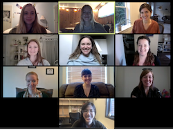
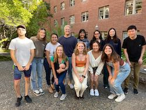
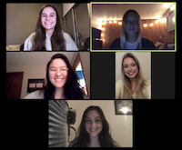
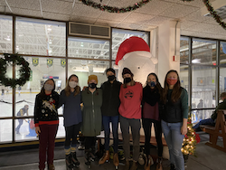
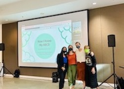
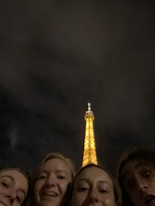
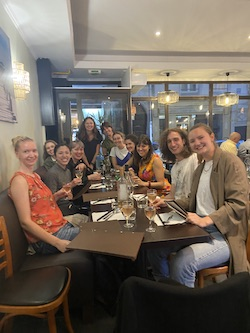

       

## current mentors + collaborators

  

Dr. Jennifer A. Silvers & <a href="https://silverslab.psych.ucla.edu/">the SAND lab</a> - University of California, Los Angeles

  > Ph.D. advisor at the University of California, Los Angeles 
    ---> expert in emotion regulation and regulates my emotions throughout grad school

  > Read more about her work [here](https://www.psych.ucla.edu/faculty-page/silvers/). Do it; she's amazing.

  

 Dr. Kate L. Mills & <a href="http://devbrainlab.org/">the DBIC lab</a> - University of Oregon

  > Undergraduate + Beyond Mentor  
    ---> taught me everything I know about structural neuroimaging

  > Click [here](https://psychology.uoregon.edu/profile/klmills/) to learn more about her. If you ever get a chance to work with her, jump at it.
  

  

Dr. Jennifer H. Pfeifer & <a href="https://uodsnlab.com/">the DSN lab</a> - University of Oregon

  > Previous Supervisor & Forever Mentor  
    ---> gave me my "aha" research moment by introducing me to the complexities of pubertal processes

  > Read all about her amazing work [here](https://psychology.uoregon.edu/profile/jpfeifer).
  

  

Dr. Birdie Shirtcliff - University of Oregon

  > Collaborator
    ---> assisted in developing the pubertal perception measure (coming soon!)

  > Get to know her and her inspiring work with puberty [here](https://psychology.uoregon.edu/news-faculty/dr-elizabeth-birdie-shirtcliff-explains-impact-stress-puberty).

  

  

Dr. Michelle Byrne - Monash University

  > Collaborator 
    ---> advises on my work centering gender inclusivity + puberty research

  > Highly recommend checking [her work](https://research.monash.edu/en/persons/michelle-byrne) out.
  

  

Dr. Theresa W. Cheng - Harvard University 

  > Undergraduate Research Mentor + Collaborator  
  ---> the reason i love coding and learning new things re: research methods

  > You need to look at what she [does](https://www.researchgate.net/profile/Theresa-Cheng-2)
  

  

Dr. Marjolein Barendse - the University of California, Davis

  > Collaborator  
    ---> introduced me to fMRI, and is my go-to for all pubertal hormone questions

  > Read more about her wonderful work [here](https://scholar.google.com/citations?user=u20NvGIAAAAJ&hl=en).
  

  

Members of the NowIKnowMyABCD team

  > Co-creators of [NowIKnowMyABCD website](https://now-i-know-my-abcd.github.io/docs/user-manual.html) 
  ---> [Sana Ali](https://twitter.com/ResearchbySana) - PhD Student at UCSD 
  ---> [Lucy Whitmore](https://twitter.com/_lucywhitmore) - PhD Student at UO 
  ---> [Monica Thieu](https://www.monicathieu.com/) - PostDoc at Emory U 
  

## present + past mentees

#### present

  

Giana Clarot- Undergraduate at UCLA

  > work together on "Pathways in Adolescence"
  > work together on conducting high school focus groups
  

#### past
  

Kathleen Rae Deguzman - Undergraduate at UCLA

  > mentored her on her honor's thesis
  

  

Maya O'Kelly - Undergraduate at UCLA

  > work together on "Pathways in Adolescence"
  

  

Kayalin Abendroth-Jones, B.S. - University of Oregon

  > Mentored on her undergraduate honors thesis  
  ---> contributed conceptual design, code, and stats
  

